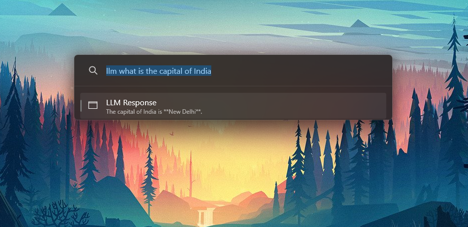

# Local LLM

PowerToys Run plugin which will enable to use LLMs on Ollama endpoints locally.



## Note

Ollama doesnt not have a release for ARM64 Windows yet. So this plugin doesnot have a ARM64 Release yet. It will be added once Ollama releases a stable ARM64 version.

## Ollama (Prerequisite)
You need to install Ollama Locally.

### Step 1: Install Ollama

1. **Visit the Ollama Website**:
   - Go to the [Ollama website](https://ollama.com) to download the latest version of Ollama.

2. **Download and Install Ollama**:
   - **Linux(wsl)**:
     - Follow the specific instructions provided on the Ollama website for your Linux distribution.
   - **Windows**:
     - Follow the specific instructions provided on the Ollama website for Windows.

3. **Verify Installation**:
   - Open a terminal and run the following command to verify that Ollama is installed:
     ```bash
     ollama --version
     ```
   - This should display the installed version of Ollama.

### Step 2: Download and Run Llama 3.1 Model
1. **Set Up the Llama 3.1 Model**:
   - Use the following command to download the Llama 3.1 model:
     ```bash
     ollama pull llama3.1
     ```
   - This will download the necessary files to run the Llama 3.1 model on your machine.

### Step 3: Use the Llama 3.1 Model in Your Application

1. **Run Llama 3.1 via API**:
   - We need to use Ollama's API. Run the API server:
     ```bash
     ollama serve
     ```
   - Then, send a POST request to the API endpoint to verify the endpoint:
     ```bash
     curl http://localhost:11434/api/generate -d '{
       "model": "llama3.1",
       "prompt": "Your prompt here"
     }'
     ```
   - This will return a response generated by the Llama 3.1 model.


### Additional Resources

- **Ollama Documentation**: Visit the [Ollama Documentation](https://ollama.com/docs) for more detailed information on using Ollama and its API.
- **Llama 3.1 Information**: Check the [Llama 3.1 details](https://ollama.com/models/llama3.1) on the Ollama website for specifics about the model.

## Usage
You need to have the Ollama endpoint running. You can check by going to [http://localhost:11434/](http://localhost:11434/). Depending on your GPU it might take some time for the LLM to generate a response as it uses your own resources.
```
llm what is the capital of india
```
### Model Selection from query
1. You can now Query the Model you want by using llm > model_name > query
   ```bash
   llm > llama3.1 > what is the capital of india
   ```

## Installation
1. Download the latest release of the Local LLM from the releases page.
2. Extract the zip file's contents to your PowerToys modules directory for the user (`%LOCALAPPDATA%\Microsoft\PowerToys\PowerToys Run\Plugins`).
3. Restart PowerToys.

Shoutout to [@Avaith3600](https://github.com/Advaith3600) for inspiring me and helping me in building this plugin.
